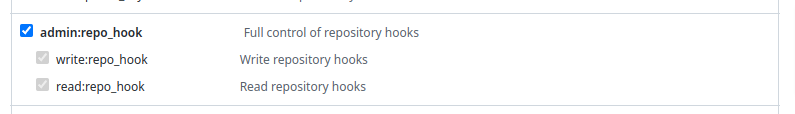

# Gitwebhook operator

This operator automates the setting up of git webhooks. Its main purpose is to stream line the configuration of operators such as Tekton or ArgoCD which rely on git webhooks for some of their functionalities.

## The GitWebhook CRD

A CRD is provided by this operator to create a git web hook, here is an example for github

```yaml
apiVersion: redhatcop.redhat.io/v1alpha1
kind: GitWebhook
metadata:
  name: gitwebhook-github
spec:
  gitHub:
    gitServerCredentials:
      name: github-pat
  repositoryOwner: ${repo_owner}
  ownerType: user
  repositoryName: ${repo_name}
  webhookURL: https://hellowebhook.com
  insecureSSL: false
  webhookSecret:
    name: webhook-secret
  events:
    - push  
  contentType: json
  active: true  
```    

here is an explanation of each field:

- `gihub` specifies how to connect to the git api server. It also requires a local reference to a secret (in the same namespace) containing a key `token` with a valid github token to be used to authenticate. A similar `gitLab` section exists when connecting to gitlab. Only one of `gitLab` or `gitHub` can be defined. 
- `repositoryOwner` and `repositoryName` identify the repository for which we want to receive events.
- `ownerType` can have two values: `user` and `organization` and identifies the kind of owner.
- `webhookURL` is the URL for to be called.
- `insecureSSL` defines whether the target URL certificate should be validated (default `false`). 
- `webhookSecret` defines a local reference to a secret containing the `secret` key. The value is a shared secret between the webhook caller and the received for farther validation or identification of the caller.
- `events` is the list of the repo-level events that the webhook should generate. The list of valid events for github can be found [here](https://docs.github.com/en/developers/webhooks-and-events/webhooks/webhook-events-and-payloads). The list of valid events for gitlab can be found [here](https://docs.gitlab.com/ee/user/project/integrations/webhook_events.html).
- `contentType` defines the format of the webhook payload (default `json`) (github).
- `active` whether the webhook should be turned on (default `true`) (github).
- `pushEventBranchFilter` a regular expression to filter from which branches push events should be generated (gitlab only).

## Security Considerations

This operator does not own credentials for the git server, but instead always allocate a new connection based on the credentials referenced in the CR and every reconcile cycle. As a result there is no risk of security escalation or credential leaking between tenants of a cluster using this operator. On the other hand it is the responsibility of the namespace owners or the platform owner to ensure that valid git credentials are always available in the namespace where the GitWebhook CRs need to defined.

## Current support

Currently this operator support creating repo-level webhooks for github and gitlab. Potentially this operator could be extended to support org-level webhook or other git systems. Contributions are welcome.


## Deploying the Operator

This is a cluster-level operator that you can deploy in any namespace, `gitwebhook-operator` is recommended.

It is recommended to deploy this operator via [`OperatorHub`](https://operatorhub.io/), but you can also deploy it using [`Helm`](https://helm.sh/).

### Multiarch Support

| Arch  | Support  |
|:-:|:-:|
| amd64  | ✅ |
| arm64  | ✅  |
| ppc64le  | ✅  |
| s390x  | ✅  |

### Deploying from OperatorHub

> **Note**: This operator supports being installed disconnected environments

If you want to utilize the Operator Lifecycle Manager (OLM) to install this operator, you can do so in two ways: from the UI or the CLI.

#### Deploying from OperatorHub UI

- If you would like to launch this operator from the UI, you'll need to navigate to the OperatorHub tab in the console. Before starting, make sure you've created the namespace that you want to install this operator to with the following:

```sh
oc new-project gitwebhook-operator
```

- Once there, you can search for this operator by name: `patch operator`. This will then return an item for our operator and you can select it to get started. Once you've arrived here, you'll be presented with an option to install, which will begin the process.
- After clicking the install button, you can then select the namespace that you would like to install this to as well as the installation strategy you would like to proceed with (`Automatic` or `Manual`).
- Once you've made your selection, you can select `Subscribe` and the installation will begin. After a few moments you can go ahead and check your namespace and you should see the operator running.

#### Deploying from OperatorHub using CLI

If you'd like to launch this operator from the command line, you can use the manifests contained in this repository by running the following commands from the folder where you cloned the repository:

```sh
oc new-project gitwebhook-operator
oc apply -f config/operatorhub -n gitwebhook-operator
```

This will create the appropriate OperatorGroup and Subscription and will trigger OLM to launch the operator in the specified namespace.

### Deploying with Helm

Here are the instructions to install the latest release with Helm.

```sh
oc new-project gitwebhook-operator
helm repo add gitwebhook-operator https://redhat-cop.github.io/gitwebhook-operator
helm repo update
helm install gitwebhook-operator gitwebhook-operator/gitwebhook-operator
```

This can later be updated with the following commands:

```sh
helm repo update
helm upgrade gitwebhook-operator gitwebhook-operator/gitwebhook-operator
```

## Metrics

Prometheus compatible metrics are exposed by the Operator and can be integrated into OpenShift's default cluster monitoring. To enable OpenShift cluster monitoring, label the namespace the operator is deployed in with the label `openshift.io/cluster-monitoring="true"`.

```sh
oc label namespace <namespace> openshift.io/cluster-monitoring="true"
```

### Testing metrics

```sh
export operatorNamespace=gitwebhook-operator-local # or gitwebhook-operator
oc label namespace ${operatorNamespace} openshift.io/cluster-monitoring="true"
oc rsh -n openshift-monitoring -c prometheus prometheus-k8s-0 /bin/bash
export operatorNamespace=gitwebhook-operator-local # or gitwebhook-operator
curl -v -s -k -H "Authorization: Bearer $(cat /var/run/secrets/kubernetes.io/serviceaccount/token)" https://gitwebhook-operator-controller-manager-metrics.${operatorNamespace}.svc.cluster.local:8443/metrics
exit
```

## Development

### Run the operator

```sh
export repo=raffaelespazzoli
docker login quay.io/$repo
oc new-project gitwebhook-operator
oc project gitwebhook-operator
oc label namespace gitwebhook-operator openshift.io/cluster-monitoring="true"
envsubst < config/local-development/tilt/env-replace-image.yaml > config/local-development/tilt/replace-image.yaml
make manifests
tilt up
```

### Test Manually

#### Github

Create a github PAT and a webhook secret and export them as variables.
Also export a repo owner and name on which the pat has access.
For frequent testing it is recommended to create a secrets.sh file a then source it. It will not be committed.
The PAT must have these permissions:



```sh
export github_pat=<your-github-pat>
export webhook_secret=<your webhook secret>
export repo_owner=<your-repo-owner>
export repo_name=<your repo name>

oc new-project test-gitwebhook-github
envsubst < ./test/pat-secret-github.yaml | oc apply -f - -n test-gitwebhook-github
envsubst < ./test/webhook-secret.yaml | oc apply -f - -n test-gitwebhook-github
envsubst < ./test/gitwebhook-github.yaml | oc apply -f - -n test-gitwebhook-github
```

#### Gitlab

Create a github PAT and a webhook secret and export them as variables.
Also export a repo owner and name on which the pat has access.
For frequent testing it is recommended to create a secrets.sh file a then source it. It will not be committed.

```sh
export gitlab_pat=<your-gitlab-pat>
export webhook_secret=<your webhook secret>
export gitlab_repo_owner=<your-repo-owner>
export gitlab_repo_name=<your repo name>

oc new-project test-gitwebhook-gitlab
envsubst < ./test/pat-secret-gitlab.yaml | oc apply -f - -n test-gitwebhook-gitlab
envsubst < ./test/webhook-secret.yaml | oc apply -f - -n test-gitwebhook-gitlab
envsubst < ./test/gitwebhook-gitlab.yaml | oc apply -f - -n test-gitwebhook-gitlab
```

### Test helm chart locally

Define an image and tag. For example...

```sh
export imageRepository="quay.io/redhat-cop/gitwebhook-operator"
export imageTag="$(git -c 'versionsort.suffix=-' ls-remote --exit-code --refs --sort='version:refname' --tags https://github.com/redhat-cop/gitwebhook-operator.git '*.*.*' | tail --lines=1 | cut --delimiter='/' --fields=3)"
```

Deploy chart...

```sh
make helmchart IMG=${imageRepository} VERSION=${imageTag}
helm upgrade -i gitwebhook-operator-local charts/gitwebhook-operator -n gitwebhook-operator-local --create-namespace
```

Delete...

```sh
helm delete gitwebhook-operator-local -n gitwebhook-operator-local
kubectl delete -f charts/gitwebhook-operator/crds/crds.yaml
```

## Building/Pushing the operator image

```sh
export repo=raffaelespazzoli #replace with yours
docker login quay.io/$repo
make docker-build IMG=quay.io/$repo/gitwebhook-operator:latest
make docker-push IMG=quay.io/$repo/gitwebhook-operator:latest
```

## Deploy to OLM via bundle

```sh
make manifests
make bundle IMG=quay.io/$repo/gitwebhook-operator:latest
operator-sdk bundle validate ./bundle --select-optional name=operatorhub
make bundle-build BUNDLE_IMG=quay.io/$repo/gitwebhook-operator-bundle:latest
docker push quay.io/$repo/gitwebhook-operator-bundle:latest
operator-sdk bundle validate quay.io/$repo/gitwebhook-operator-bundle:latest --select-optional name=operatorhub
oc new-project gitwebhook-operator
oc label namespace gitwebhook-operator openshift.io/cluster-monitoring="true"
operator-sdk cleanup gitwebhook-operator -n gitwebhook-operator
operator-sdk run bundle --install-mode AllNamespaces -n gitwebhook-operator quay.io/$repo/gitwebhook-operator-bundle:latest
```

## Releasing

```sh
git tag -a "<tagname>" -m "<commit message>"
git push upstream <tagname>
```

If you need to remove a release:

```sh
git tag -d <tagname>
git push upstream --delete <tagname>
```

If you need to "move" a release to the current main

```sh
git tag -f <tagname>
git push upstream -f <tagname>
```

### Cleaning up

```sh
operator-sdk cleanup gitwebhook-operator -n gitwebhook-operator
oc delete operatorgroup operator-sdk-og
oc delete catalogsource gitwebhook-operator-catalog
```